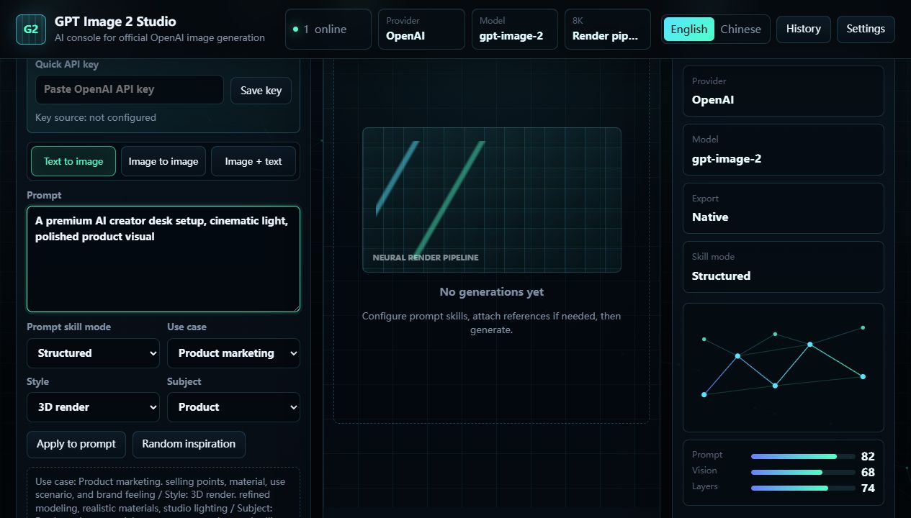
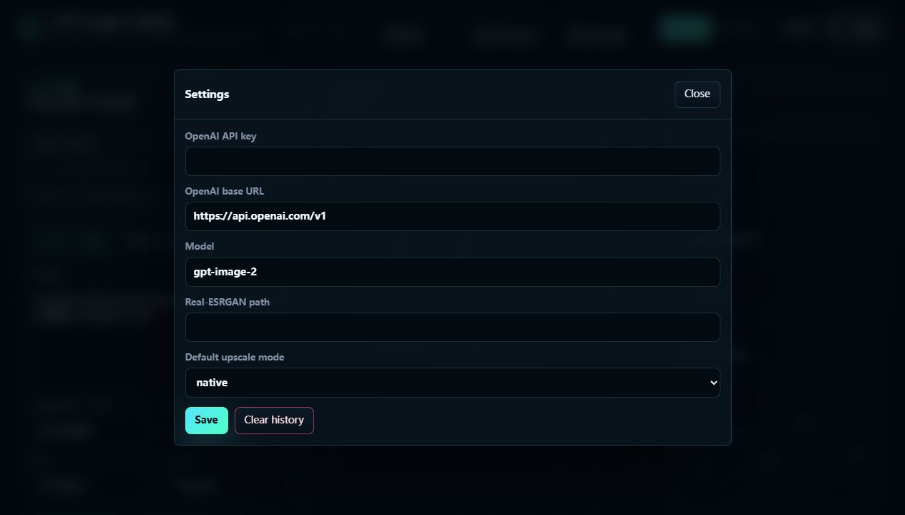
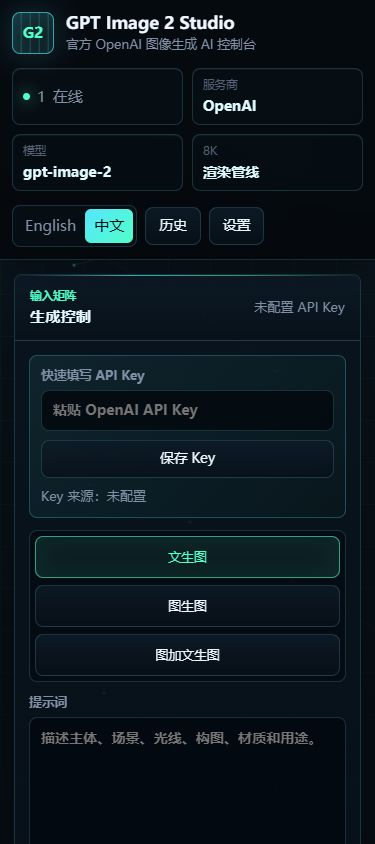

<div align="center">

# GPT Image 2 Studio

### 面向官方 OpenAI Images API 的本地生图工作台

[](#运行要求)
[](https://www.python.org/)
[](https://fastapi.tiangolo.com/)
[](LICENSE)

**公开版使用你自己的官方 OpenAI API Key；仓库不内置 API Key，也不包含第三方服务商配置。**

[English](README.md) | 简体中文 | [项目主页](https://iroha-p.github.io/gpt-image-2-openai-public/) | [下载源码](https://github.com/Iroha-P/gpt-image-2-openai-public/archive/refs/heads/main.zip) | [OpenAI Images API](https://platform.openai.com/docs/guides/images)

</div>

## 为什么做 GPT Image 2 Studio？

很多生图 Demo 只是一个 API 表单，而完整创作软件又太重。**GPT Image 2 Studio** 放在中间：它是一个本地网页控制台，保留提示词 Skill、参考图流程、1K 到 8K 导出规划、PSD 辅助和结果历史，同时默认直接调用官方 OpenAI 图片 API。

- **官方 OpenAI API**：默认使用 `https://api.openai.com/v1`，支持 `OPENAI_API_KEY`
- **适合公开发布的配置**：仓库里的 `config.json` 保持 `openai_api_key` 为空，本地密钥写入被 Git 忽略的 `config.local.json`
- **大量生图 Skill**：接入 [EvoLinkAI/awesome-gpt-image-2-API-and-Prompts](https://github.com/EvoLinkAI/awesome-gpt-image-2-API-and-Prompts) 的生图 Skill，并整理为可操作的工作流控件
- **文本、图片、混合生成**：支持文生图、图生图、图文混合生成
- **生产导出辅助**：1K 到 8K 预设、原生/放大导出标签、可读结果镜像，以及可选 PSD 图层

## 功能区导览

<table>
  <tr>
    <td width="64%">
      
    </td>
    <td width="36%">
      <strong>工作台控制台</strong><br>
      主界面把提示词编辑、生成模式、图片 Skill 选择、导出尺寸、模型状态和结果区放在同一个工作台里，适合连续调试提示词，而不是只发起一次 API 调用。
    </td>
  </tr>
  <tr>
    <td width="64%">
      
    </td>
    <td width="36%">
      <strong>安全配置面板</strong><br>
      设置区默认使用官方 OpenAI Base URL，公开仓库里的 API Key 保持为空，真实本地密钥会进入被 Git 忽略的本地配置文件。
    </td>
  </tr>
  <tr>
    <td width="64%">
      
    </td>
    <td width="36%">
      <strong>移动端布局</strong><br>
      窄屏下仍保留完整生成流程，包括快速 API Key 输入、中英文切换、历史记录、设置入口和堆叠后的提示词工具。
    </td>
  </tr>
</table>

## 生图 Skill

公开版保留内部 Skill 版的高级提示词工作流，但生成链路改为官方 OpenAI API。项目同时接入 [EvoLinkAI/awesome-gpt-image-2-API-and-Prompts](https://github.com/EvoLinkAI/awesome-gpt-image-2-API-and-Prompts) 的生图 Skill，并把它们整理成用途、风格、主体三个方向的控制项。

内置 Skill 组合包括：

- **10 类用途 Skill**：头像、社媒图、信息图、YouTube 封面、分镜、产品营销、电商主图、游戏资产、海报、App/Web 设计
- **16 类视觉风格 Skill**：摄影、电影剧照、动漫漫画、插画、线稿、漫画、3D 渲染、Q 版、等距、像素艺术、油画、水彩、中国水墨、复古、赛博朋克、极简
- **15 类主体 Skill**：人像、模特、角色、多人/情侣、产品、食物饮品、服饰单品、车辆、建筑/室内、风景、城市、图表、字体排版、抽象背景等

这些预设能组合出大量结构化生图方向。你可以只轻量增强提示词，也可以生成完整结构化提示词，还可以用随机灵感快速找创意起点。

## 功能

### 官方 OpenAI 生成

- 通过 `/images/generations` 文生图
- 通过 `/images/edits` 图像编辑
- 可配置模型名，默认 `gpt-image-2`
- API Key 可来自环境变量、本地配置或应用内快速输入

### 提示词 Skill 控制台

- 自由、轻增强、结构化三种提示词模式
- 用途、风格、主体选择器
- 随机灵感按钮
- 生成后的提示词可一键回填继续编辑
- 中英文双语界面标签

### 导出与后处理

- 1K 到 8K 尺寸预设
- 清晰标注原生导出与放大导出
- 支持标准缩放或 Real-ESRGAN 路径
- 本地输出历史
- 可读结果镜像，方便快速浏览

### PSD 流程

- 可选导出 `result_layers.psd`
- 适合 Photoshop 分层工作的同画布图层提示
- 可配置容差的白底移除

## 快速开始

### 1. 安装依赖

```powershell
pip install -r requirements.txt
```

### 2. 设置你的 OpenAI API Key

推荐使用环境变量：

```powershell
$env:OPENAI_API_KEY="your_api_key_here"
```

也可以在应用里的快速 API Key 输入框粘贴密钥。本地凭据会保存到 `config.local.json`，该文件已被 Git 忽略。

### 3. 启动应用

```powershell
.\start.bat
```

打开：

```text
http://127.0.0.1:8170/
```

## 配置

公开仓库默认配置：

```json
{
  "openai_api_key": "",
  "openai_base_url": "https://api.openai.com/v1",
  "model": "gpt-image-2",
  "main_port": 8170,
  "realesrgan_path": "",
  "default_upscale_mode": "native"
}
```

凭据优先级：

1. `OPENAI_API_KEY` 环境变量
2. 本地 `config.local.json`
3. 公开默认 `config.json`

仓库版本刻意不包含真实 API Key，也不包含第三方服务商配置。

## 运行要求

- Python 3.11 或更新版本
- 有图片生成权限的官方 OpenAI API Key
- 现代浏览器
- 可选：用于 AI 放大的 Real-ESRGAN 可执行文件

## 项目结构

```text
GPT-Image-2-Studio/
|-- app.py
|-- config.json
|-- config.example.json
|-- gpt_image_tool/
|   |-- core.py
|   |-- openai_client.py
|   |-- prompt_skills.py
|   |-- processing.py
|   `-- psd_export.py
|-- templates/
|   `-- index.html
|-- docs/
|   |-- index.html
|   |-- screenshot-studio.png
|   |-- screenshot-settings.png
|   `-- screenshot-mobile.png
|-- README.md
`-- README.zh-CN.md
```

## 安全说明

- 不要提交 `config.local.json`
- 不要提交生成结果
- 公开仓库中的 `config.json` 必须保持脱敏
- 默认使用官方 OpenAI Base URL，除非你主动切换到兼容端点

## License

MIT
